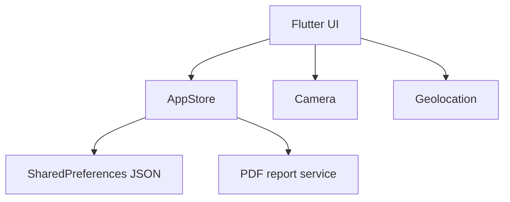

# EcoAudit

An offline-first environmental compliance inspection app built with Flutter. EcoAudit helps field inspectors register facilities, document environmental findings with photo and GPS evidence, calculate compliance scores, assign corrective actions, and export professional PDF reports.

## Portfolio highlights

- Offline local persistence with JSON serialization
- Camera and geolocation integration
- Automated, severity-weighted compliance scoring
- Corrective-action workflow and overdue detection
- PDF report generation and native sharing
- Material 3 responsive interface
- Seeded demo data for an immediate product walkthrough
- Unit tests for critical scoring logic

## Screens

1. Dashboard with compliance KPIs
2. Inspection register
3. Inspection detail, evidence, and report export
4. Corrective-action tracker
5. Facility management

## Run locally

Install Flutter 3.24 or newer, then run:

```bash
flutter create . --platforms=android,ios
flutter pub get
flutter run
```

The first command generates the standard native platform folders while preserving this project's source code.

### Android permissions

After generating the Android folder, add these entries above `<application>` in `android/app/src/main/AndroidManifest.xml`:

```xml
<uses-permission android:name="android.permission.CAMERA" />
<uses-permission android:name="android.permission.ACCESS_FINE_LOCATION" />
<uses-permission android:name="android.permission.ACCESS_COARSE_LOCATION" />
```

### iOS permissions

Add these keys to `ios/Runner/Info.plist`:

```xml
<key>NSCameraUsageDescription</key>
<string>Capture evidence during environmental inspections.</string>
<key>NSLocationWhenInUseUsageDescription</key>
<string>Attach coordinates to environmental findings.</string>
```

## Test

```bash
flutter test
```

## Architecture



## Next production milestones

- Replace JSON persistence with Drift/SQLite for larger datasets
- Add FastAPI/PostgreSQL synchronization and JWT authentication
- Add configurable inspection templates
- Add role-based access and cloud evidence storage
- Add integration tests and CI/CD

## License

MIT
