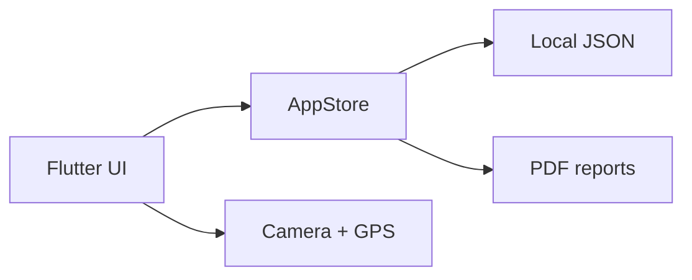

<div align="center">

# 🌱 EcoAudit

**Offline-first environmental compliance inspections for field teams.**


</div>

## Overview

EcoAudit helps inspectors register facilities, document findings with photo and GPS evidence, calculate compliance scores, manage corrective actions, and export PDF reports—even without a network connection.

<!-- Upload a real screenshot as docs/ecoaudit-dashboard.png, then uncomment:

-->

## Features

- Offline persistence with SharedPreferences
- Facility and inspection registers
- Camera evidence and GPS coordinates
- Severity-weighted compliance scoring
- Corrective actions and overdue detection
- PDF report generation and native sharing
- Seeded demonstration data
- Material 3 responsive interface
- Unit-tested scoring logic

## Technology

`Flutter` · `Dart` · `SharedPreferences` · `Image Picker` · `Geolocator` · `PDF` · `Printing`

## Run locally

Requirements: Flutter 3.24+ and a configured Android/iOS toolchain.

```bash
git clone https://github.com/ahvi27/ecoaudit.git
cd ecoaudit
flutter create . --platforms=android,ios
flutter pub get
flutter run
```

Add camera and location permissions to the generated native projects before testing evidence capture.

## Test

```bash
flutter test
flutter analyze
```

## Architecture



## Roadmap

- Drift/SQLite storage
- FastAPI and PostgreSQL synchronization
- Authentication and role-based access
- Configurable inspection templates
- Cloud evidence storage and CI/CD

## License

MIT — see [LICENSE](LICENSE).

## Author

Built by [Gelila Mulugeta](https://github.com/ahvi27).
